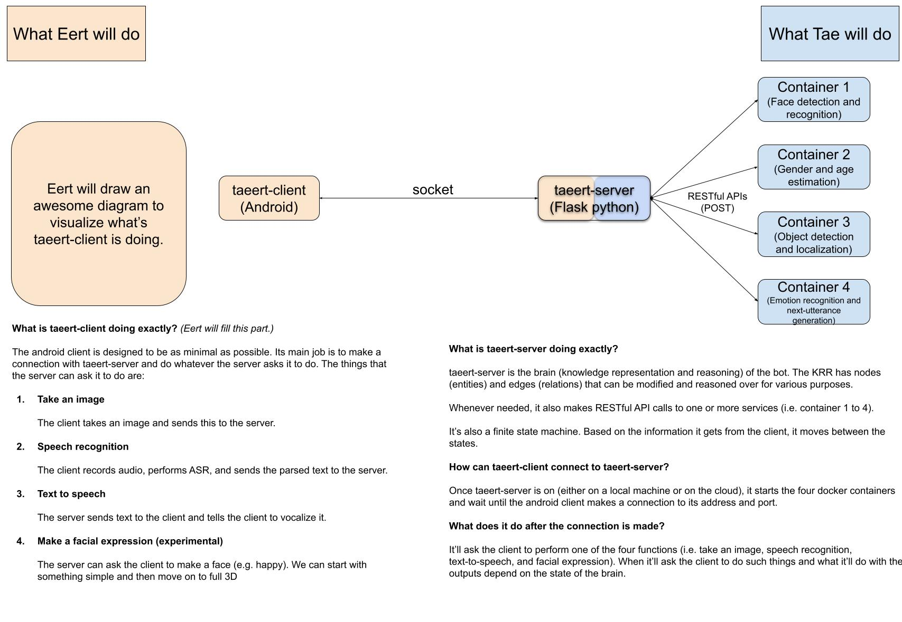

# Taeert

Taeert: Mul**t**imod**a**l, **E**mpath**e**tic, And Memo**r**yful Bo**t**

Taeert is an android-based bot that uses multiple sensory inputs. Taeert is not only empathetic but has memory.
This is an open-source proejct, where everyone can make contributions. Some publications will also be made on the way.

## Embodiment

Taeert is not necessarily an embodied robot, but it's possible. Tae actually has a 3D printer.

## Software Design Choices

At the moment, it's very likely that Taeert will run as an application on Android. Already many humanoid robots run on Android. Also Android provides you with decent SDKs. Below are some specific design choices. They are subject to changes. Please do hack them.

### State Machine

There can be several states. These are high-level states. There can be sub-states within them.

1. Idle
   * Nothing is happening.
   * There are no humans around.
2. Greeting
   * Taeert just found a human.
   * Taeert has to recognize if it knows this human or not.
     * If it does, it moves to Bonding state.
     * If it doesn't, it moves to either to Friend or Family state, based on the connections they've made before.
3. Bonding
   * Taeert seeks to have bonding with the human.
   * Taeert gets to know the human.
   * If bonding goes well, it moves to Friend state.
   * If the human leaves, then it goes back to Idle state.
4. Friend
   * Taeert and the human are in this state because they are friends.
   * Taeert wants to know even more about the human.
   * If they become so close, it moves to Family state.
   * If the human leaves before having more serious conversation, then it moves back to Idle state.
5. Family
   * This is the ultimate state. The purpose of Taeert is to be family with humans.
   * Taeert and the human like each other a lot.

### What can be done within the Android app

1. Taking images from the camera
    * The images should be sent to the external APIs (e.g. object detector, face recognition, etc.).
2. Voice stuff
    * AFAIK, recording voice, voice activity detection, speech to text, text to speech, etc. can be done within Android.
3. Rendering Taeert
    * At the moment, it's likely that Taeert is simply a static image but some realistic graphical Taeert can also be rendered.

### External APIs

These are some compute-intensive stuff that can't really be done within Android. These are probably all deep neural networks written in Python. These APIs can be Flask servers.

These APIs can tehnically run from anywhere (e.g. cloud, your local machine, etc.), as long as your android device has access to the endpoints.

1. Face detection / recognition
    * This is relatively easy. 
    * The API gets an image and outputs the bounding boxes around the faces and their face embedding vectors. It's up to the client how and what to do with them.
2. Object detection
    * This works almost the same as Face detection / recognition.
    * The API gets an image and outputs the bounding boxes around the objects that it can detect along with the category of the objects.
3. Next utterance generation (NLG)
    * Given the past $N$ utterances, this API can generate the most likely utterance that should be vocalized by the Android app. This can be done with GPT-3 but that's huge ...
4. Emotion recognition
    * Traditionally this is done by using images, audio, and text, to classify one's emotion.
    * I don't think this traditional approach is scalable. Better way to do is to have the next utterance generation also predict emotion at the same time.
5. Brain (knowledge representation and reasoning)
    * Taeert has a brain which consists of a bunch of symbols (entities) connected with edges (relations). This is a knowledge base (a.k.a. knowledge graph).
    * In every state, Taeert fully takes advantage of its brain to achieve its goal.

### Event Driven Architecture (EDA)

I'm very not familar with this. Can anyone tell me how this can be used in our project?

## Contributing

Contributions are what make the open source community such an amazing place to be learn, inspire, and create. Any contributions you make are **greatly appreciated**.

1. Fork the Project
2. Create your Feature Branch (`git checkout -b feature/AmazingFeature`)
3. Commit your Changes (`git commit -m 'Add some AmazingFeature'`)
4. Push to the Branch (`git push origin feature/AmazingFeature`)
5. Open a Pull Request

## Authors

* [Taewoon Kim](https://taewoonkim.com/) 

## Authors

Taewoon Kim (https://taewoonkim.com/)

Eert Hoogerwerf (eert.hoogerwerf@gmail.com)
